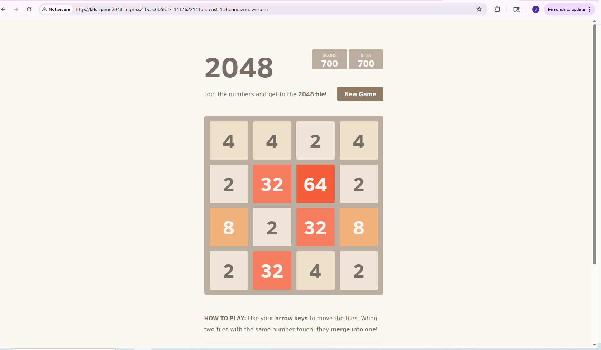
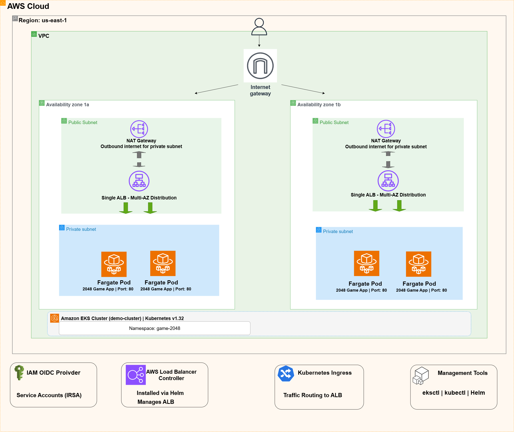

# EKS Container Platform


**Context:** Deployed the classic 2048 game on Amazon EKS with Fargate over a weekend.
Total cost: under $20. This repo contains the infrastructure code and documentation
that go with the Medium post:
[I Built an EKS Cluster for Under $20. Here's What Tutorials Don't Tell You.](https://medium.com/@jhamelthorne)

```
Internet → ALB → EKS Fargate Pods (game-2048 namespace) → 2048 Game
```



## Architecture



**Stack:**
- Amazon EKS (Kubernetes 1.32)
- AWS Fargate (serverless containers — no EC2 nodes to manage)
- Application Load Balancer (via AWS Load Balancer Controller)
- VPC with public and private subnets across 2 availability zones
- OIDC provider + IAM Roles for Service Accounts (IRSA)

**Tools:**
- `eksctl` — cluster creation and OIDC setup
- `kubectl` — deployments and debugging
- `Helm` — AWS Load Balancer Controller installation

## Repository Structure

```
eks-game-deployment/
├── Architecture/
│   ├── EKS.drawio.png          # Architecture diagram
│   └── Design_Decisions.md     # Why this stack was chosen
├── assets/
│   └── working-k8s-game.PNG    # Screenshot of live deployment
├── cluster/
│   └── cluster-config.yaml     # eksctl ClusterConfig (K8s 1.32, Single NAT)
├── iam/
│   └── iam_policy.json         # AWS Load Balancer Controller IAM policy
├── k8s/
│   ├── namespace.yaml          # game-2048 namespace
│   ├── deployment.yaml         # 3 replicas, 0.25 vCPU / 0.5 GB (Fargate minimum)
│   ├── service.yaml            # NodePort (required for ALB target-type: ip)
│   └── ingress.yaml            # internet-facing ALB, target-type: ip
├── scripts/
│   ├── deploy.sh               # Full deployment in one command
│   └── teardown.sh             # Safe ordered teardown (see note below)
├── Cost_Analysis.md
└── Lessons_Learned.md
```

## Prerequisites

- AWS CLI configured with appropriate permissions
- `kubectl`, `eksctl`, `helm` installed
- An AWS account in us-east-1 (or update the region in `cluster/cluster-config.yaml`)

## Deployment

```bash
# Clone and deploy
git clone https://github.com/JhamelT/eks-game-deployment
cd eks-game-deployment
bash scripts/deploy.sh
```

The script runs these steps in order:

### 1. Create the cluster

```bash
eksctl create cluster -f cluster/cluster-config.yaml
```

This creates the VPC, Fargate profiles, and OIDC provider (~15-20 minutes).
The config uses a **Single NAT Gateway** — see the cost note below.

### 2. Verify OIDC and wait for propagation

```bash
aws eks describe-cluster --name demo-cluster \
  --query "cluster.identity.oidc.issuer"

sleep 30  # IAM propagation delay before creating service accounts
```

### 3. Create IAM policy and service account (IRSA)

```bash
aws iam create-policy \
  --policy-name AWSLoadBalancerControllerIAMPolicy \
  --policy-document file://iam/iam_policy.json

eksctl create iamserviceaccount \
  --cluster=demo-cluster \
  --namespace=kube-system \
  --name=aws-load-balancer-controller \
  --role-name=AmazonEKSLoadBalancerControllerRole \
  --attach-policy-arn=arn:aws:iam::<ACCOUNT-ID>:policy/AWSLoadBalancerControllerIAMPolicy \
  --approve
```

### 4. Install Load Balancer Controller via Helm

```bash
helm repo add eks https://aws.github.io/eks-charts
helm repo update eks
helm install aws-load-balancer-controller eks/aws-load-balancer-controller \
  -n kube-system \
  --set clusterName=demo-cluster \
  --set serviceAccount.create=false \
  --set serviceAccount.name=aws-load-balancer-controller
```

### 5. Deploy the application

```bash
kubectl apply -f k8s/namespace.yaml
kubectl apply -f k8s/deployment.yaml
kubectl apply -f k8s/service.yaml
kubectl apply -f k8s/ingress.yaml
```

### 6. Get the URL (ALB takes 2-5 minutes to provision)

```bash
kubectl get ingress -n game-2048 -w
# Wait for the ADDRESS field to populate, then:
kubectl get ingress ingress-2048 -n game-2048 \
  -o jsonpath='{.status.loadBalancer.ingress[0].hostname}'
```

## Kubernetes Resources

| File | Resource | Purpose |
|------|----------|---------|
| `k8s/namespace.yaml` | Namespace `game-2048` | Fargate profile scoping and workload isolation |
| `k8s/deployment.yaml` | Deployment, 3 replicas | Game pods with explicit resource requests |
| `k8s/service.yaml` | Service (NodePort) | Internal routing; NodePort required for ALB IP mode |
| `k8s/ingress.yaml` | Ingress (ALB) | Internet-facing ALB with `target-type: ip` |

**Key configuration choices:**
- `target-type: ip` is required for Fargate. Fargate pods have no EC2 instance backing, so the ALB targets pod IPs directly via each pod's ENI.
- `NodePort` service type is required alongside IP-mode ALB routing.
- Resource requests match Fargate's minimum unit (0.25 vCPU, 0.5 GB). Fargate rounds up to the nearest supported configuration, so over-requesting wastes money.

## Cost Breakdown (Weekend Deploy, ~60 hours, us-east-1)

| Component | Rate | ~60-hour cost |
|-----------|------|---------------|
| EKS control plane | $0.10/hr | **~$6.00** |
| Fargate compute (3 pods × 0.25 vCPU / 0.5 GB) | ~$0.037/hr | ~$2.22 |
| NAT Gateway (Single, base only) | $0.045/hr | ~$2.70 |
| Application Load Balancer (base) | $0.0225/hr | ~$1.35 |
| Data transfer | variable | ~$0.50 |
| **Total** | | **~$12-16** |

**The EKS control plane fee ($0.10/hr = $72/month) is the single largest cost driver.**
It accrues whether the cluster has zero pods or a thousand. A forgotten learning cluster
costs ~$150+/month in background charges. Run `teardown.sh` when done.

**NAT Gateway note:** `cluster/cluster-config.yaml` sets `nat: gateway: Single` to share
one NAT Gateway across both AZs. The eksctl default (`HighlyAvailable`) creates one per AZ —
two in this setup — doubling the base NAT cost. Single NAT is appropriate for a learning
project. For production, use `HighlyAvailable` to avoid cross-AZ traffic routing on a
single-AZ failure.

See [Cost_Analysis.md](./Cost_Analysis.md) for a full Fargate vs EC2 monthly comparison.

## Cleanup

**Order matters.** Running `eksctl delete cluster` directly can fail because AWS cannot
delete the VPC while an ALB is still attached to its subnets. The ALB is managed by
Kubernetes — it must be removed through Kubernetes first.

```bash
bash scripts/teardown.sh
```

What `teardown.sh` does in order:
1. Deletes the Ingress → triggers the Load Balancer Controller to remove the ALB
2. Waits for the ALB to be fully deregistered in AWS
3. Uninstalls the Helm chart
4. Deletes remaining k8s resources
5. Deletes the IAM service account
6. Runs `eksctl delete cluster` (safe once ALB is gone)
7. Deletes the IAM policy

## Monitoring

```bash
# Check all resources in the namespace
kubectl get all -n game-2048

# Watch ingress for ALB address
kubectl get ingress -n game-2048 -w

# Debug pod scheduling issues
kubectl describe pod -n game-2048

# Check Load Balancer Controller logs
kubectl logs -n kube-system deployment/aws-load-balancer-controller
```

## Troubleshooting

See [Lessons_Learned.md](./Lessons_Learned.md) for detailed writeups. Quick reference:

| Symptom | Likely cause | Fix |
|---------|-------------|-----|
| Pods stuck `Pending` | Fargate profile namespace mismatch | Check: `eksctl get fargateprofile --cluster demo-cluster` |
| ALB never created | Load Balancer Controller crashing | Check: `kubectl logs -n kube-system deploy/aws-load-balancer-controller` |
| 503 from ALB | Service selector ≠ pod labels | Check: `kubectl get endpoints -n game-2048` — empty means mismatch |
| OIDC auth errors | IAM propagation delay | Wait 30s after OIDC setup, verify issuer URL matches service account annotation |
| `eksctl delete cluster` fails | ALB still attached to VPC | Delete Ingress first, wait for ALB removal, then delete cluster |

## Security

**IRSA:** The Load Balancer Controller gets only the permissions it needs to manage ALBs.
No node-level IAM role grants blanket AWS access. The OIDC provider bridges Kubernetes
service account tokens to AWS IAM roles.

**AWS note:** EKS Pod Identity (launched late 2023) is a simpler alternative to IRSA
for new projects. IRSA is used here — it remains widely documented and well-understood.

**Namespace isolation:** Fargate profiles explicitly declare which namespaces they serve.
Pods in unlisted namespaces won't schedule on Fargate. This is a security boundary, not
just a configuration detail.

## Additional Resources

- [Lessons_Learned.md](./Lessons_Learned.md) — five things that broke and why
- [Cost_Analysis.md](./Cost_Analysis.md) — Fargate vs EC2 with monthly projections
- [Architecture/Design_Decisions.md](./Architecture/Design_Decisions.md) — architecture rationale

## Acknowledgments

Builds on the Day 22 EKS tutorial from
[iam-veeramalla/aws-devops-zero-to-hero](https://github.com/iam-veeramalla/aws-devops-zero-to-hero/tree/main/day-22),
with extended cost analysis, troubleshooting, and production patterns.
