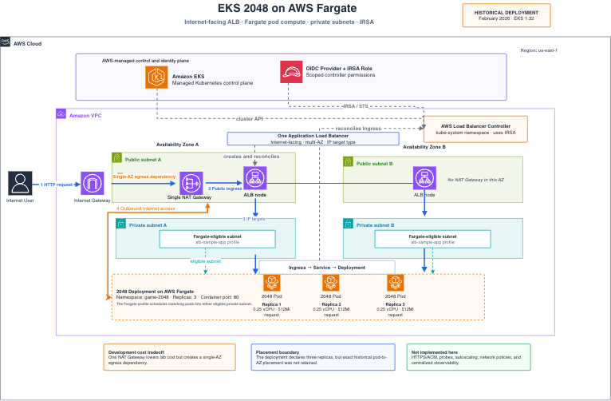
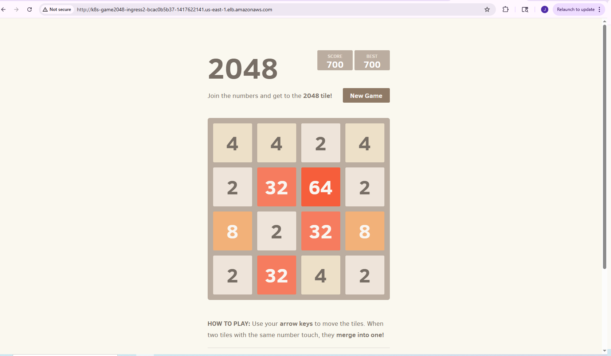

# EKS 2048 on AWS Fargate


A production-aligned learning project that deployed the classic 2048 game on
Amazon EKS with AWS Fargate.

The original environment ran for approximately 60 hours in February 2026 and
cost less than $20 before it was torn down. This repository documents the
architecture, Kubernetes resources, AWS identity integration, troubleshooting,
cost model, and dependency-aware cleanup process.

> [!IMPORTANT]
> This repository preserves the original Kubernetes 1.32 deployment
> configuration. Version 1.32 was in Amazon EKS standard support when the
> project was deployed, but it entered extended support on March 23, 2026.
> Do not create a new cluster from this configuration without first selecting a
> version currently in standard support and validating add-on compatibility.

- [Original project walkthrough](https://www.loom.com/share/bcb9a621c73346ad8f8ec2b287e60c45)
- [Cost and troubleshooting write-up](https://medium.com/@JZMT/i-built-an-eks-cluster-for-under-20-heres-what-tutorials-don-t-tell-you-82206440abe1)

---

## Request and Egress Paths

```text
Inbound:
User -> internet-facing ALB -> IP target group -> Fargate pod ENI

Outbound:
Fargate pod -> single NAT Gateway -> Internet Gateway
```

The NAT Gateway is not part of the inbound application path. It provides
outbound connectivity for workloads running in private subnets.





---

## Architecture

### AWS services and platform components

- Amazon EKS managed Kubernetes control plane
- AWS Fargate for pod compute
- AWS Load Balancer Controller
- One internet-facing Application Load Balancer
- VPC with public and private subnets across two Availability Zones
- One NAT Gateway as a development-cost tradeoff
- Cluster OIDC provider
- IAM Roles for Service Accounts (IRSA)

### Kubernetes resources

- Dedicated `game-2048` namespace
- Deployment with three application replicas
- NodePort Service
- Ingress configured for ALB IP targets
- Fargate profiles for system and application namespaces

The VPC and ALB span two Availability Zones. The architecture does not claim
that the three Fargate replicas are guaranteed to remain evenly distributed
across those zones.

---

## Why AWS Fargate

Fargate removed the need to create, patch, scale, and replace EC2 worker nodes.
That allowed this project to focus on:

- Kubernetes scheduling
- Fargate profile selectors
- Private networking
- Ingress and load balancing
- Pod-level AWS permissions
- Cost visibility
- Ordered infrastructure teardown

Fargate does not make the workload free while idle. The Deployment declares
three replicas, so those pods continue generating compute charges until the
workload is explicitly scaled down or deleted.

See [Architecture/Design_Decisions.md](./Architecture/Design_Decisions.md) for
the complete decision record.

---

## Repository Structure

```text
eks-game-deployment/
├── Architecture/
│   ├── EKS.drawio.png          # Architecture diagram
│   └── Design_Decisions.md     # Decisions, tradeoffs, and limitations
├── assets/
│   └── working-k8s-game.PNG    # Screenshot of the running application
├── cluster/
│   └── cluster-config.yaml     # Historical EKS 1.32 eksctl configuration
├── iam/
│   └── iam_policy.json         # Load Balancer Controller IAM policy
├── k8s/
│   ├── namespace.yaml          # game-2048 namespace
│   ├── deployment.yaml         # 3 replicas; 250m CPU and 512Mi requested
│   ├── service.yaml            # NodePort backend Service
│   └── ingress.yaml            # Internet-facing ALB with IP targets
├── scripts/
│   ├── deploy.sh               # Historical deployment workflow
│   └── teardown.sh             # Dependency-aware teardown
├── Cost_Analysis.md
├── Lessons_Learned.md
└── README.md
```

---

## Historical Deployment Workflow

The following sequence documents how the original environment was created. It
is retained for learning and auditability.

> [!CAUTION]
> Do not run `scripts/deploy.sh` unchanged for a new deployment. First update
> the Kubernetes version, review the current AWS Load Balancer Controller IAM
> policy, pin the Helm chart and controller versions, and validate the scripts
> in a non-production AWS account.

### Prerequisites

- AWS CLI configured with appropriate permissions
- `kubectl`
- `eksctl`
- Helm
- An AWS account and cost controls
- Region configured as `us-east-1`, or corresponding configuration changes

### 1. Create the cluster

```bash
eksctl create cluster -f cluster/cluster-config.yaml
```

The historical configuration creates:

- The EKS cluster
- A VPC
- Public and private subnets across two Availability Zones
- One NAT Gateway
- Fargate profiles
- The cluster OIDC provider

### 2. Verify OIDC

```bash
aws eks describe-cluster   --name demo-cluster   --region us-east-1   --query "cluster.identity.oidc.issuer"
```

### 3. Create the controller IAM policy and service account

```bash
aws iam create-policy   --policy-name AWSLoadBalancerControllerIAMPolicy   --policy-document file://iam/iam_policy.json
```

```bash
eksctl create iamserviceaccount   --cluster demo-cluster   --namespace kube-system   --name aws-load-balancer-controller   --role-name AmazonEKSLoadBalancerControllerRole   --attach-policy-arn arn:aws:iam::<ACCOUNT-ID>:policy/AWSLoadBalancerControllerIAMPolicy   --approve
```

### 4. Install the AWS Load Balancer Controller

The original workflow installed the controller through Helm:

```bash
helm repo add eks https://aws.github.io/eks-charts
helm repo update eks

helm install aws-load-balancer-controller   eks/aws-load-balancer-controller   --namespace kube-system   --set clusterName=demo-cluster   --set serviceAccount.create=false   --set serviceAccount.name=aws-load-balancer-controller
```

A modernized deployment should pin the chart version rather than implicitly
installing the latest available release.

### 5. Deploy the application

```bash
kubectl apply -f k8s/namespace.yaml
kubectl apply -f k8s/deployment.yaml
kubectl apply -f k8s/service.yaml
kubectl apply -f k8s/ingress.yaml
```

### 6. Retrieve the ALB hostname

```bash
kubectl get ingress -n game-2048 -w
```

```bash
kubectl get ingress ingress-2048   --namespace game-2048   --output jsonpath='{.status.loadBalancer.ingress[0].hostname}'
```

---

## Kubernetes Resource Behavior

| File | Resource | Purpose |
|------|----------|---------|
| `k8s/namespace.yaml` | Namespace | Matches the application Fargate profile |
| `k8s/deployment.yaml` | Deployment | Runs three 2048 application replicas |
| `k8s/service.yaml` | NodePort Service | Backend referenced by the Ingress |
| `k8s/ingress.yaml` | ALB Ingress | Creates internet-facing ALB routing |

### ALB IP target mode

The Ingress uses:

```yaml
alb.ingress.kubernetes.io/target-type: ip
```

IP target mode is required for Fargate because there are no EC2 worker nodes to
register as instance targets. The ALB registers the Fargate pod IP addresses
directly.

AWS supports `NodePort` or `LoadBalancer` Services for this traffic mode. This
project uses `NodePort`; it does not claim that NodePort is the only supported
Service type.

### Service selector

The Service selector must match the Deployment pod labels:

```yaml
app.kubernetes.io/name: app-2048
```

A mismatch creates a Service with no endpoints, causing the ALB to return 503
responses.

### Fargate resource sizing

Each application container requests:

```yaml
cpu: "250m"
memory: "512Mi"
```

Amazon EKS adds Fargate platform overhead to the pod's memory request before
selecting a supported configuration. Because of that overhead, these pods are
expected to provision at 0.25 vCPU and 1 GB.

The `CapacityProvisioned` annotation on a running pod is the final source of
truth for the provisioned and billable capacity.

---

## IAM and Workload Identity

The AWS Load Balancer Controller uses IRSA:

```text
Kubernetes service account
        |
        v
Cluster OIDC provider
        |
        v
Scoped IAM role
        |
        v
AWS Elastic Load Balancing APIs
```

This avoids assigning the controller's AWS permissions broadly through an EC2
worker-node role.

EKS Pod Identity is not supported for pods running on AWS Fargate. IRSA is
therefore the appropriate supported pod-level AWS identity mechanism for this
Fargate-based controller deployment.

The Fargate profile namespace selectors determine which pods are eligible to
run on Fargate. They are a scheduling control, not a complete Kubernetes
security boundary.

---

## Cost Analysis

### Historical weekend deployment

Approximate base cost for 60 hours while EKS 1.32 was in standard support:

| Component | Calculation | Approximate Cost |
|-----------|-------------|------------------|
| EKS control plane | 60 × $0.10 | $6.00 |
| Three Fargate application pods | 60 × $0.043695 | $2.62 |
| One NAT Gateway | 60 × $0.045 | $2.70 |
| Application Load Balancer | 60 × $0.0225 | $1.35 |
| **Base subtotal** | | **$12.67** |

The subtotal excludes variable NAT processing, ALB capacity units, data
transfer, logging, and supporting Fargate workloads. The observed weekend total
remained below $20.

### Standard-support monthly projection

For three application pods running continuously:

| Component | Approximate Monthly Cost |
|-----------|--------------------------|
| EKS control plane | $72.00 |
| Three Fargate application pods | $31.46 |
| One NAT Gateway | $32.40 |
| Application Load Balancer base charge | $16.20 |
| **Base subtotal** | **$152.06** |

### Version-lifecycle warning

EKS 1.32 entered extended support on March 23, 2026. A cluster still running
that version would have a substantially higher control-plane charge than the
historical standard-support estimate.

See [Cost_Analysis.md](./Cost_Analysis.md) for:

- Calculation details
- Extended-support impact
- Eight-hour workload scenario
- Fargate versus EC2 tradeoffs
- NAT Gateway versus VPC endpoint considerations

---

## Single NAT Gateway Decision

The project uses one NAT Gateway to reduce fixed cost in a short-lived learning
environment.

Accepted tradeoffs:

- Private workloads in both Availability Zones depend on one NAT Gateway.
- An Availability Zone failure can interrupt outbound connectivity.
- Cross-AZ routing can create additional processing charges.

A production environment should evaluate:

- One NAT Gateway per Availability Zone
- Required high-availability level
- VPC endpoints for supported AWS services
- Expected traffic volume
- Security and egress-control requirements

VPC endpoints can improve private AWS-service connectivity and security, but
multiple interface endpoints across multiple Availability Zones are not
automatically cheaper than one NAT Gateway.

---

## Cleanup

Teardown order matters. The ALB is created from a Kubernetes Ingress but is
attached to VPC subnets in AWS. Attempting to delete the cluster and VPC first
can fail while the ALB still exists.

Run:

```bash
bash scripts/teardown.sh
```

The teardown workflow:

1. Deletes the Ingress.
2. Waits for the controller to remove the ALB.
3. Uninstalls the controller Helm release.
4. Deletes the application resources.
5. Deletes the IAM service account.
6. Deletes the EKS cluster.
7. Deletes the customer-managed IAM policy.

---

## Monitoring and Validation

```bash
# Check application resources
kubectl get all -n game-2048

# Check whether the Service has endpoints
kubectl get endpoints -n game-2048

# Watch for the ALB hostname
kubectl get ingress -n game-2048 -w

# Inspect scheduling failures
kubectl describe pod -n game-2048

# Inspect the controller
kubectl logs   --namespace kube-system   deployment/aws-load-balancer-controller
```

To verify actual Fargate capacity:

```bash
kubectl get pods   --namespace game-2048   --output jsonpath='{range .items[*]}{.metadata.name}{"\t"}{.metadata.annotations.CapacityProvisioned}{"\n"}{end}'
```

---

## Troubleshooting

See [Lessons_Learned.md](./Lessons_Learned.md) for detailed write-ups.

| Symptom | Likely Cause | Investigation |
|---------|--------------|---------------|
| Pods remain `Pending` | Namespace does not match a Fargate profile | `eksctl get fargateprofile --cluster demo-cluster` |
| ALB is not created | Controller is unhealthy or lacks permissions | Review controller logs and service-account role |
| ALB returns 503 | Service selector does not match pod labels | `kubectl get endpoints -n game-2048` |
| OIDC or STS errors | Trust policy or propagation problem | Verify issuer and service-account annotation |
| Cluster deletion fails | ALB still attached to VPC subnets | Delete Ingress and wait for ALB deletion |

---

## Current Limitations

This repository demonstrates production-aligned patterns, but it is not a
complete production platform.

Current limitations include:

- Historical EKS version
- Unpinned controller chart
- Mutable `latest` application image tag
- No HTTPS or ACM certificate
- No AWS WAF
- No readiness or liveness probes
- No Horizontal Pod Autoscaler
- No scheduled or event-driven scaling
- No centralized metrics dashboard
- No CI/CD deployment pipeline
- No Terraform or CloudFormation implementation

---

## Modernization Roadmap

1. Deploy on an EKS version currently in standard support.
2. Pin the controller chart and image versions.
3. Refresh the IAM policy from the current controller release.
4. Pin the application image by digest.
5. Add readiness and liveness probes.
6. Capture `CapacityProvisioned` for billing validation.
7. Add automated deployment tests.
8. Rebuild the infrastructure with Terraform.
9. Add HTTPS, monitoring, and policy checks.
10. Compare NAT Gateway and VPC endpoint costs using measured traffic.

---

## Additional Resources

- [Lessons_Learned.md](./Lessons_Learned.md)
- [Cost_Analysis.md](./Cost_Analysis.md)
- [Architecture/Design_Decisions.md](./Architecture/Design_Decisions.md)
- [Original Loom walkthrough](https://www.loom.com/share/bcb9a621c73346ad8f8ec2b287e60c45)
- [Medium cost and troubleshooting article](https://medium.com/@JZMT/i-built-an-eks-cluster-for-under-20-heres-what-tutorials-don-t-tell-you-82206440abe1)
